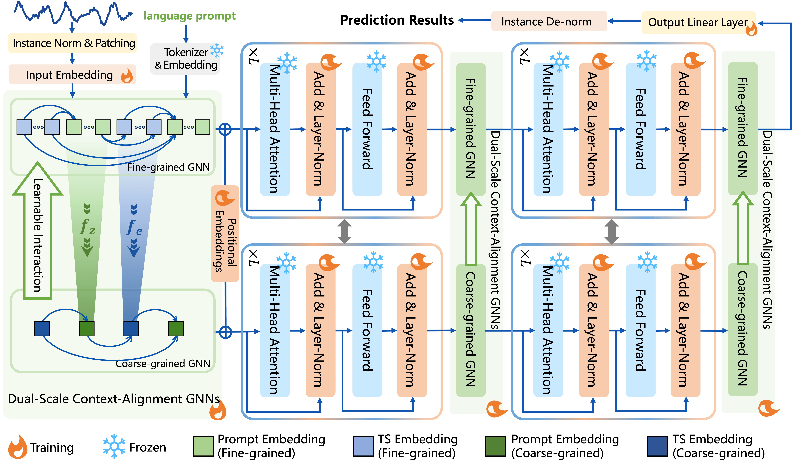

<div align="center">
  <h2><b> (ICLR'25) Context-Alignment: Activating and Enhancing LLM Capabilities in Time Series </b></h2>
</div>

> If this resource has been helpful to you, we'd love it if you could give us a star ⭐ and cite our research!

```
@article{hu2025context,
title={Context-Alignment: Activating and Enhancing LLM Capabilities in Time Series},
author={Hu, Yuxiao and Li, Qian and Zhang, Dongxiao and Yan, Jinyue and Chen, Yuntian},
journal={arXiv preprint arXiv:2501.03747},
year={2025}
}
```

The official implementation of our ICLR-2025 paper "**Context-Alignment: Activating and Enhancing LLM Capabilities in Time Series**" [[Arxiv](https://arxiv.org/abs/2501.03747)] [[ICLR](https://openreview.net/forum?id=syC2764fPc&noteId=44soT9LsfI&referrer=%5BAuthor%20Console%5D(%2Fgroup%3Fid%3DICLR.cc%2F2025%2FConference%2FAuthors%23your-submissions))]. The repo using [Wandb](https://wandb.ai/) to manage.

## Introduction

<p align="center">

</p>

Recently, leveraging pre-trained Large Language Models (LLMs) for time series
(TS) tasks has gained increasing attention, which involves activating and enhancing LLMs’ capabilities. Many methods aim to activate LLMs’ capabilities based
on token-level alignment, but overlook LLMs’ inherent strength in natural language processing — their deep understanding of linguistic logic and structure
rather than superficial embedding processing. We propose Context-Alignment
(CA), a new paradigm that aligns TS with a linguistic component in the language
environments familiar to LLMs to enable LLMs to contextualize and comprehend TS data, thereby activating their capabilities.

## Usage

All experiments were performed using NVIDIA H800 80GB GPUs, NVIDIA A800 80GB GPUs or GeForce RTX 4090 GPUs. (The experiments can be run on a single GPU, but please note that some settings may require more than 24GB of VRAM.)

1. Prerequisites:
   
   Note that GMAA is only tested on Ubuntu OS with the following environments. It may work on other operating systems (i.e., Windows) as well but we do not guarantee that it will.
   
   + Please refer to `env.sh` and `requirements.txt` to complete the environment configuration

2. Prepare the datasets:
   
   + Download all the datasets from [[TimesNet](https://github.com/thuml/Time-Series-Library)].
   
3. Training Configuration:
   
   + For each task, you can use the subfolder `scirpts` for training, and the training results will be visualized and recorded via Wandb.
   + Wandb records of [long-term forecasting](https://wandb.ai/tokaka/iclr25-fsca-lt/table?nw=nwusertokaka) and [zero-shot forecasting](https://wandb.ai/tokaka/iclr25-fsca-zt/table?nw=nwusertokaka) are provided for you to refer.


## Acknowledge

We appreciate the following github repos a lot for their valuable code base or datasets:
[[Time-LLM](https://github.com/KimMeen/Time-LLM/blob/main/README.md)][[One Fits All](https://github.com/DAMO-DI-ML/NeurIPS2023-One-Fits-All/tree/main?tab=readme-ov-file)][[TimesNet](https://github.com/thuml/Time-Series-Library)]


